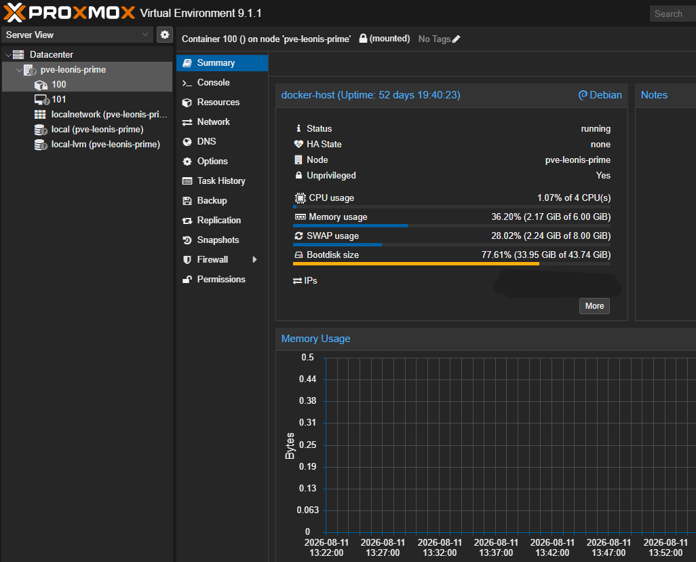
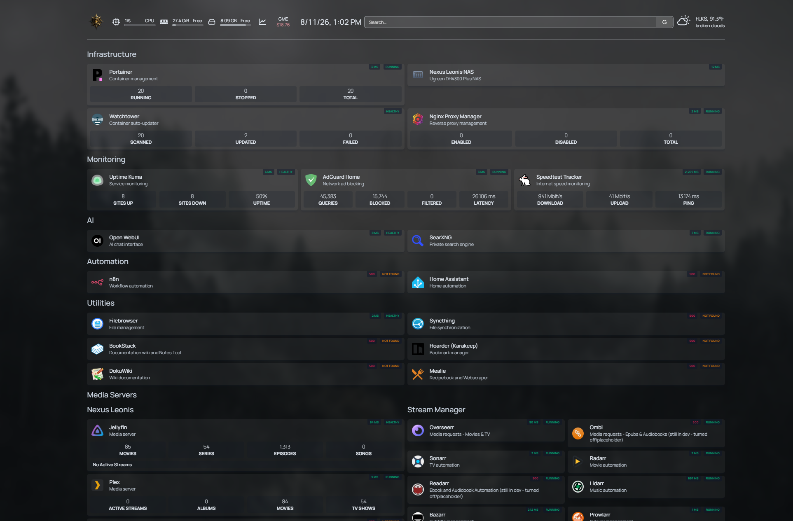
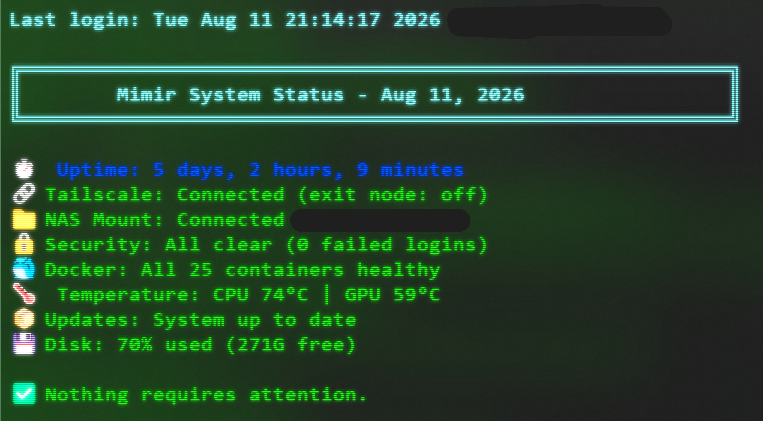
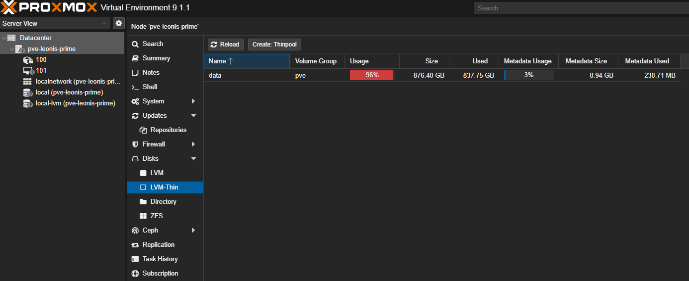

# NexusLeonis Homelab - Historical Project

  

> \*\*Historical build record:\*\* I retired this environment on \*\*11 August 2026\*\*. I am preserving it in its final state before wiping the system for a full rebuild based on the lessons I learned from operating, expanding, and troubleshooting it. This repository is no longer maintained and is not intended to be a deployable build guide.

NexusLeonis started as a way to teach myself systems administration by actually running systems instead of only reading about them. I had no prior professional IT administration experience, so I used documentation, community resources, and LLMs, primarily Claude, as an interactive learning and troubleshooting aid while I built. Instead of treating the model as a substitute for understanding, I used it to help interpret unfamiliar errors, explain Linux and infrastructure concepts, suggest diagnostic paths, and work through logs until I could identify the actual failure point. Log-based root-cause analysis became one of the main ways I learned to troubleshoot the environment.

What began as a single Proxmox host with Docker inside an LXC gradually grew into a multi-system homelab spanning Linux, virtualization, containerized services, centralized storage, monitoring, remote access, automation, media services, and local AI experimentation. As the environment became more complex, the work shifted from simply deploying applications to understanding how virtualization, networking, storage, permissions, and containers interacted when something failed.

I did not build the original environment with Git or a formal documentation process in mind. I documented some phases heavily and others barely at all, especially once the lab became more complex. That became one of the clearest lessons from the project: documentation, configuration organization, and version control need to exist from the beginning, not get added after the environment is already difficult to untangle.

This repository is the final historical record of what the lab became.

## How the Environment Evolved

### 1\. Proxmox + Docker LXC

The original core was a custom-built PC running **Proxmox VE**. A Debian LXC container acted as the primary Docker host, with **Portainer** used to deploy and manage container stacks.

  

Early services included Portainer, Homepage, Watchtower, Uptime Kuma, AdGuard Home, Speedtest Tracker, Filebrowser, Syncthing, n8n, Home Assistant, and Mealie.

I built a custom Homepage dashboard as the central view of the environment, added service status and API-backed widgets, and used Uptime Kuma for active monitoring and downtime notifications. Watchtower handled scheduled container updates.

The screenshot below shows the Homepage dashboard from the later life of the original environment. Services and status indicators changed over time as the lab evolved.

  

### 2\. Expansion into a Full Self-Hosted Stack

The Docker environment expanded into several functional groups:

* Infrastructure and container management
* Monitoring and network utilities
* Local AI and private search tools
* File synchronization and documentation tools
* Home and workflow automation
* Media servers
* Media management and automation

BY the end of the build, I had roughly 30 services running in the environment, although a small number were placeholders or deployed but not fully configured at the time of the final snapshot.

I also customized the presentation of the media environment, including a dedicated NexusLeonis header for Jellyfin.

  

This phase pushed the project beyond simply installing containers. I had to manage port conflicts, persistent storage, container permissions, API integrations, monitoring, updates, and service dependencies while keeping the environment usable.

### 3\. Centralized NAS Storage

As the environment grew, local storage on the Proxmox host was no longer enough for media, application data, AI models, and shared files.

I added a dedicated NAS with multiple large-capacity drives and integrated it with both Linux and Windows systems. The design used **NFS for Linux-hosted workloads** and **SMB for Windows access**, allowing the same storage system to support container data, media libraries, AI assets, backups, and shared files.

This became one of the more educational parts of the project. Persistent mounts, ownership, permissions, and the interaction between NAS storage, Linux, LXC, and Docker created repeated troubleshooting work.

### 4\. A Second Linux/Docker System

An ASUS ROG Zephyrus laptop was repurposed as **Mimir**, a Linux Mint workstation and secondary Docker host. It became a sandbox for Linux administration and additional self-hosted workloads.

Mimir hosted services including local AI interfaces, private search, media applications, monitoring, automation, and archival utilities. I also created basic shell scripts and cron jobs for security auditing, system updates, system-status reporting, and diagnostics. One of those scripts produced a single terminal status view for uptime, Tailscale connectivity, NAS mounts, failed-login checks, Docker container health, CPU/GPU temperatures, pending updates, and disk utilization.

  

Remote access across the lab used **Tailscale VPN (Tailnet)**, allowing systems and selected services to be reached without exposing them directly to the public internet. I tested this extensively while traveling to Germany and successfully was able to reach my local network and stream media hosted on my NAS in Kansas.

### 5\. Full VM + GPU Passthrough Experimentation

The Proxmox host also included **Mimir-Tower**, a full CachyOS Linux virtual machine intended for heavier local AI and Docker workloads.

I configured PCIe GPU passthrough for an NVIDIA RTX 2070 Super using IOMMU/VFIO so the VM could directly use the GPU. GPU passthrough and CUDA had been working inside the guest before the storage failure. Once the LVM-thin issue occurred, however, the CachyOS VM could no longer be started, which effectively ended further work on that part of the lab.

This was the most technically ambitious part of the original lab, but it also exposed the failure that ultimately ended the build. Corrupted LVM-thin metadata left Proxmox reporting only a small fraction of the NVMe's true available space. The issue remained unresolved and became the primary reason I stopped maintaining the original environment rather than continue building on an unreliable storage layer.

## Problems I Had to Work Through

The original environment was useful because it broke in real ways.

### Docker and LXC permissions

Running Docker inside an LXC introduced additional permission and ownership complexity. Some containers did not behave correctly with the expected UID/GID mappings, forcing me to troubleshoot access between the container layer, the LXC host, and mounted storage.

### Unreliable direct SSH access

Direct SSH access to the Docker LXC was unreliable during part of the project. I used the Proxmox host as a reliable management path while troubleshooting the container's access behavior.

### Service API and dashboard integrations

Homepage widgets exposed several small but real integration problems. Examples included Docker API version mismatches, service-specific API requirements, authentication configuration, and strict host validation. The solution usually required reading logs, testing endpoints, and adjusting container or widget configuration rather than simply restarting the service.

### Port conflicts and service configuration

As the number of containers increased, I had to track port mappings and resolve collisions between services that expected the same defaults.

### NAS mounts and permissions

Centralizing storage introduced NFS/CIFS mount issues and permission problems. Some mounts required manual recovery after restarts, and nested permissions between the NAS, Linux, LXC, and Docker became a recurring source of troubleshooting.

### GPU passthrough

Passing the NVIDIA GPU directly to a Proxmox VM required host-level IOMMU/VFIO configuration, GPU driver isolation on the host, and VM-specific passthrough configuration. Before the LVM-thin failure, the GPU was successfully assigned to the CachyOS VM with CUDA available inside the guest. After the storage issue, the VM could no longer be started.

### LVM-thin metadata corruption

The most serious issue, and ultimately the reason I retired the original build, was corruption in the Proxmox LVM-thin metadata pool. Proxmox stopped reporting the NVMe's capacity correctly relative to what was physically available, and the storage problem eventually prevented the CachyOS GPU VM from starting at all.

  
   
  Proxmox reporting 96% usage on the \\\\\\\~1 TB NVMe-backed LVM-thin pool, even though the Docker LXC itself had only \\\\\\\~45 GB allocated and was using 33.95 GB.

Repair required taking the affected storage offline and attempting `thin\\\\\\\_repair`. I attempted but never successfully completed that repair, and the capacity problem remained unresolved through the end of the project. Rather than keep adding fixes and services on top of a storage layer that became near unusable, I chose to preserve the environment's final state for record, take the lessons learned, and start over cleanly.

### VM startup and console behavior

The GPU-enabled VM also required troubleshooting around bridge timing during startup and noVNC console configuration. A startup delay resolved the boot-order issue, while retaining a standard virtual display was necessary for reliable console access.

## What I Learned

The project gave me hands-on experience with:

* Proxmox virtualization and LXC administration
* Linux system administration
* Docker and Portainer
* Container deployment and troubleshooting
* Persistent storage and volume management
* NAS integration with NFS and SMB/CIFS
* Service monitoring and alerting
* Tailscale remote connectivity
* DNS and reverse-proxy tooling
* Log-based troubleshooting
* Shell scripting and cron-based automation
* GPU passthrough with IOMMU/VFIO
* CUDA-enabled Linux workloads
* Basic service hardening and operational maintenance

The bigger lesson was how quickly small architectural decisions compound as a system grows. Problems stopped belonging to one application and started crossing Linux, virtualization, networking, storage, permissions, and container boundaries.

Documentation became part of that lesson too. Because I had not treated documentation and version control as part of the original architecture, I often had to reconstruct what changed after the fact. A future build needs current architecture notes, organized configuration, clear ownership of where things live, and a meaningful change history from the beginning. The limited process history in this repository is a direct result of learning that lesson the hard way.

